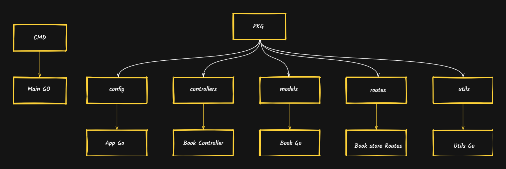
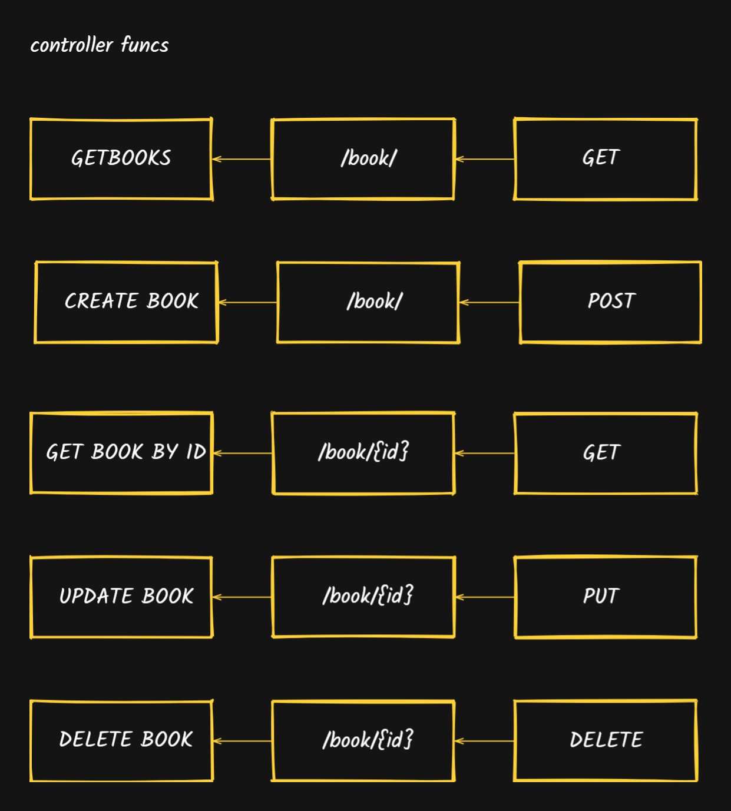
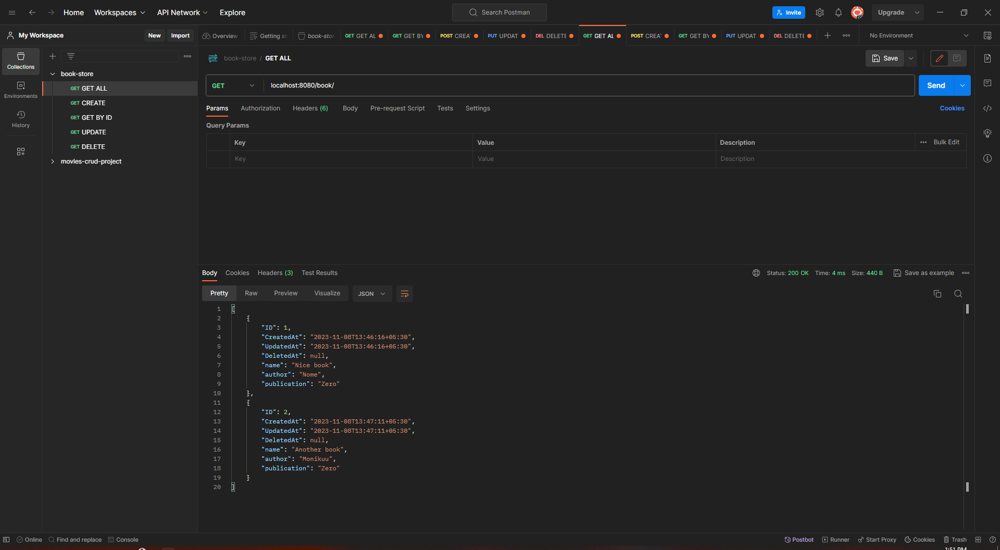
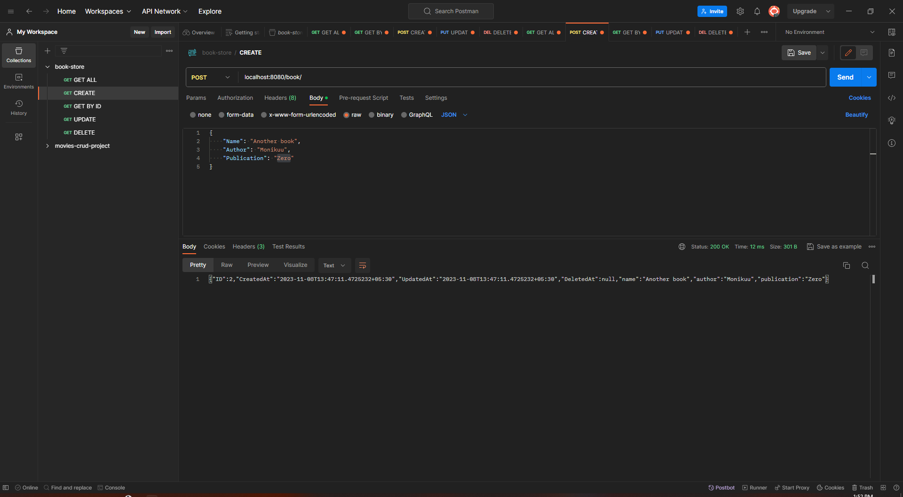
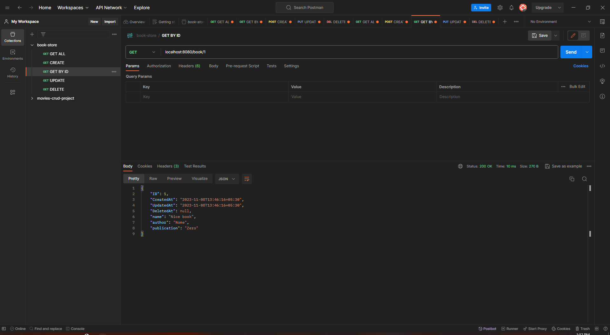
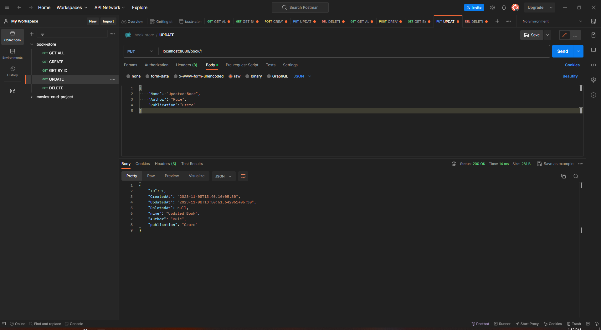
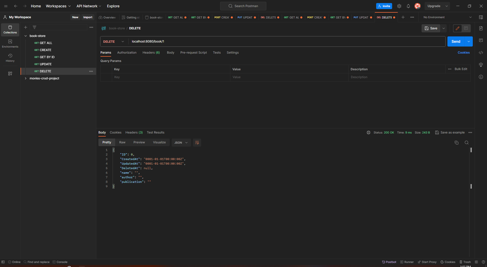
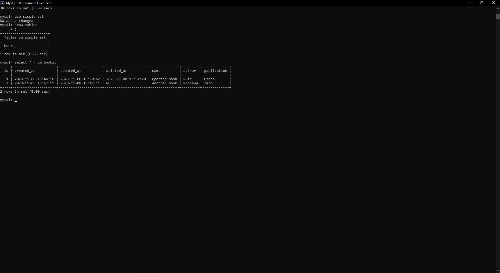

# BookStore Management System

1. Database - MYSQL

1. GORM

1. Json Marshall, unmarshall

1. Project Structure

1. Gorilla Mux

## Project Structure

## Routes

### Testing APIs

#### GET ALL

#### CREATE

#### GET BY ID

#### UPDATE

#### DELETE

Following is the Database created by **Gorm:**

